# Fundamentals of Azure
## Security and Compliance
## Objectives 
- [Create a management group](Answers.md#how-to-create-a-management-group)
- [Move a subscription to the management group](Answers.md#how-to-move-a-subscription-to-the-management-group) 
- [Assign an Azure Policy at the management group level](Answers.md#how-to-assign-an-azure-policy) 
- [Test the Azure policy](Answers.md#test-the-azure-policy) 
  
Message me if you are having issues accessing one. 
## Exercise:  
### How to create a management group
  Navigate to the management group page by searching **Management Groups** in the search bar: 

  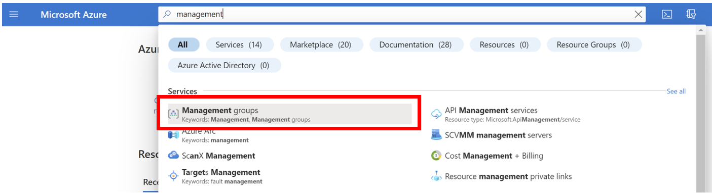

  Click on create: 
  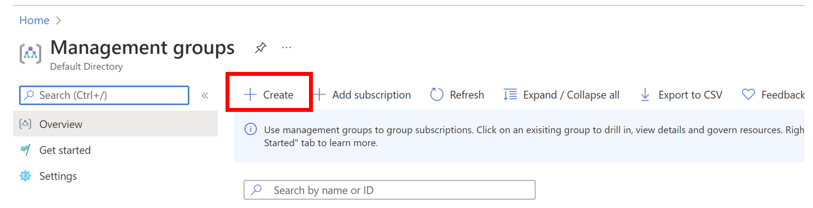

  Fill in the boxes then click on submit 
  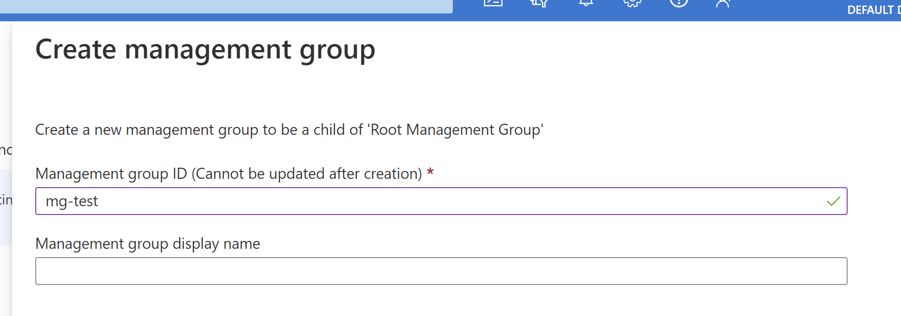

###  How to move a subscription to the management group 
While still on the management group page, click the three dots next to the subscription that you want to move:    

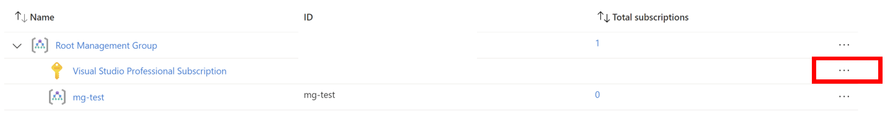  

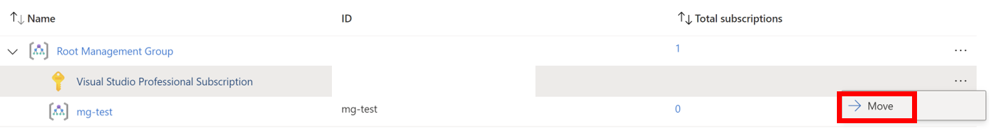
Afterwards make sure the "New Parent Management group" is the newly created management group then hit save. 

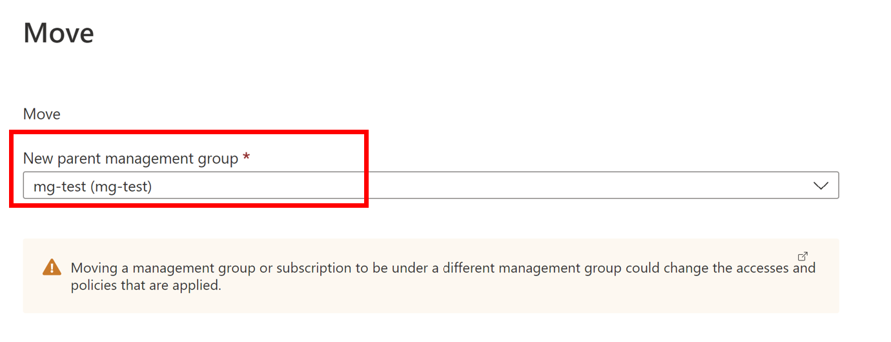 
### How to assign an Azure Policy 
Navigate to the policy page by search **Policy** in the search bar: 

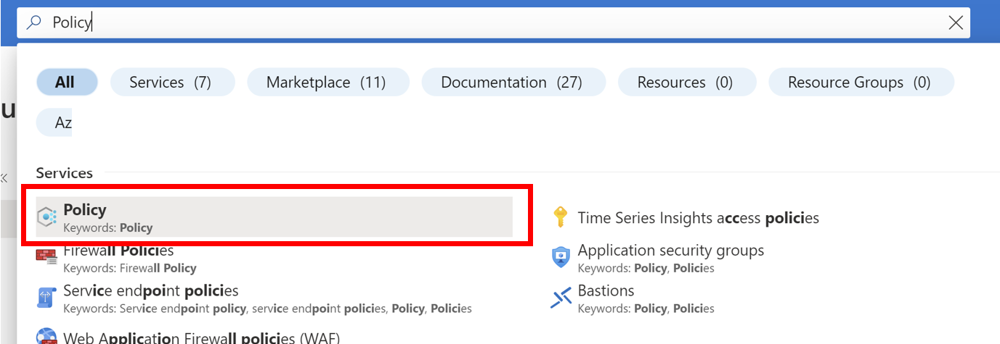

Next hit **Assignments** on the left bar

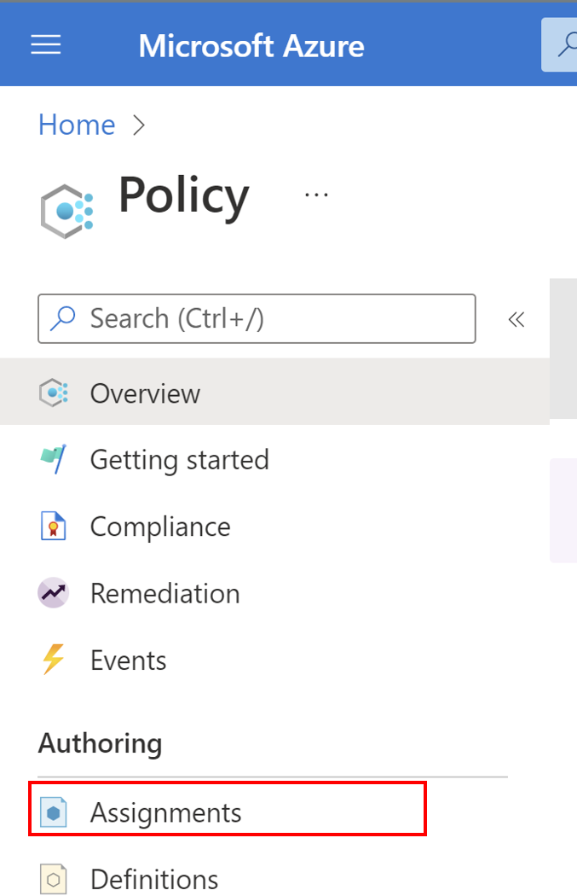

Click on **Assign policy**

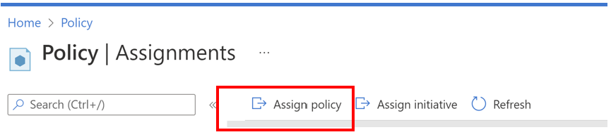
Make sure the scope is assigned at the management group level
    - Click on the three dots next to scope 
  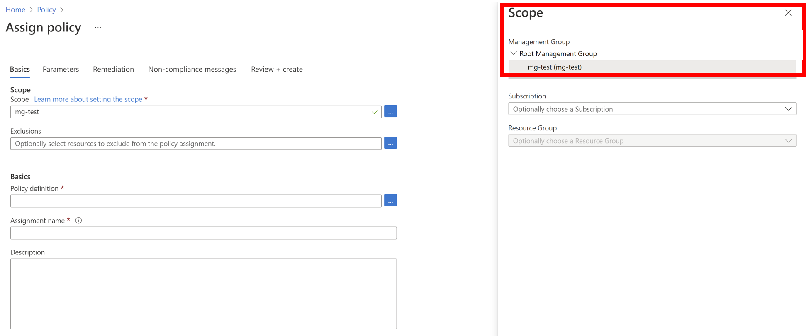

  Next click on the three dots next to **Policy definition**. In the search bar, look for "Add a tag to resource groups" 
  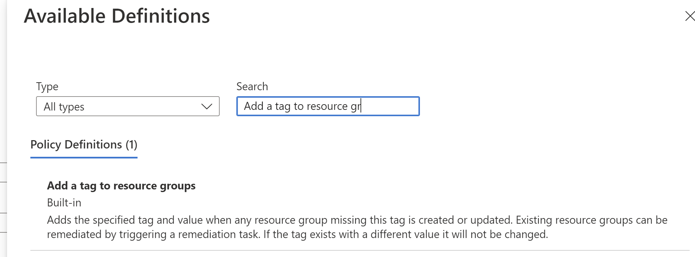

  Click next to fill in the parameters 
  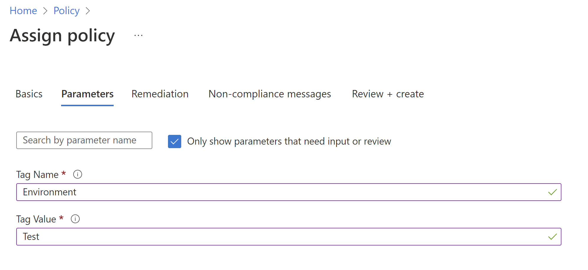

  Keep hitting next, create a non-compliance message if you'd like, then review and create. 
### Test the Azure Policy
    Test the newly created Azure policy on a resource group. You should see the newly created resource group with the parameters from the previous task. 
#### How to Create a Resource Group
  - Click on the hamburger button in the upper left-hand corner of the screen 
  
    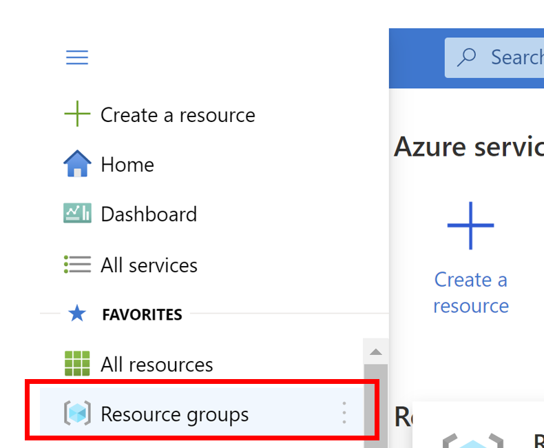
 
  - Click on Create 
    
    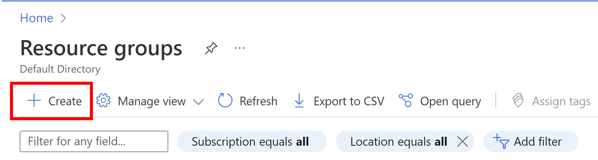
  - Fill out the boxes then click create
   
   
   
  #### **DO NOT FILL OUT THE TAG TAB**  
   - Navigate back to your newly created resource group and you should see the tags
  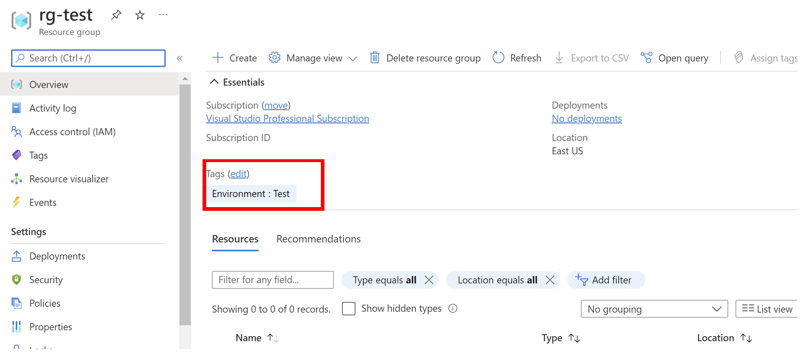
