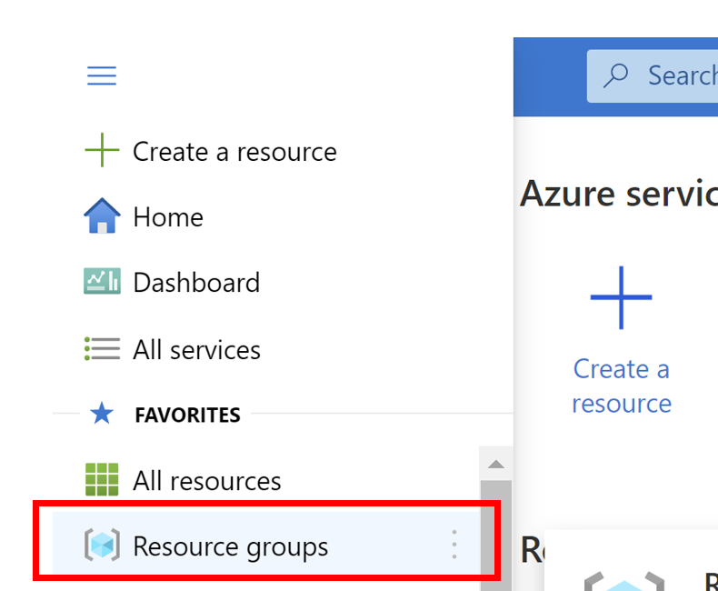
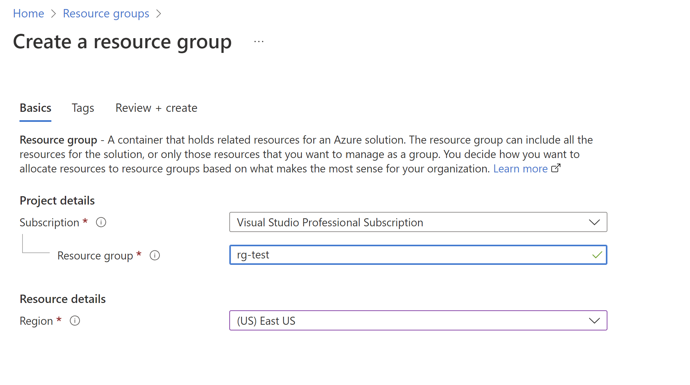

# Fundamentals of Azure
## Security and Compliance
## Objectives 
- Create a management group 
- Move a subscription to the management group 
- Assign an Azure Policy at the management group level 
- Test the Azure policy 
Message me if you are having issues accessing one. 
## Exercise:  
### Create a management group
  Create a management group named: 
  mg-test 
### Move your subscription to the management group  
### Assign an Azure Policy 
  Assign an "Add a tag to resource groups" Azure policy. Set the parameters "Tag Name = Environment" : "Tag Value = Test"  
  Create a non-compliance message of your choice.
    
### Test the Azure Policy
    Test the newly created Azure policy on a resource group. You should see the newly created resource group with the parameters from the previous task. 
#### How to Create a Resource Group
  - Click on the hamburger button in the upper left-hand corner of the screen 
    
  - Click on Create 
    
  - Fill out the boxes then click create
   
   **DO NOT FILL OUT THE TAG TAB**  
### You can find the answers here
  [Answer doc](Answers.md) 